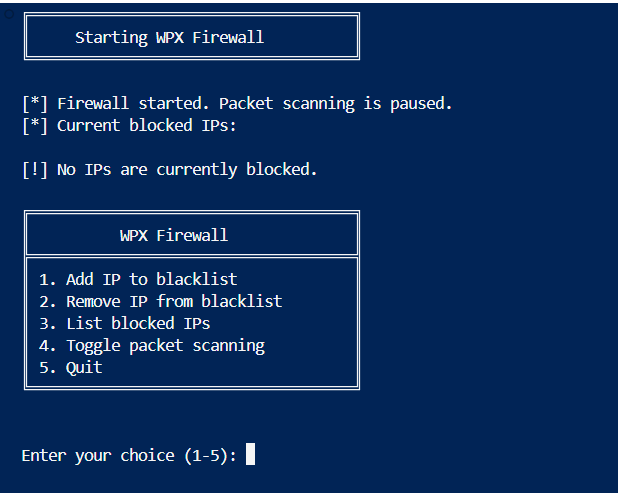

# WPX Firewall

A Python-based network firewall with an interactive interface for real-time packet monitoring and IP blocking.



## Features

- Real-time packet capture and analysis
- Interactive menu interface
- Pause/Resume packet scanning
- IP blacklist management
- Automatic logging system
- Persistent blacklist storage
- Visual feedback for all operations

## Requirements

- Python 3.x
- Scapy library
- Administrator privileges
- Windows: Npcap (required for packet capture)
- Linux: libpcap-dev

## Installation

1. Clone the repository:

```bash
git clone https://github.com/Wil-JC-Pimenta/wpx_firewall

cd wpx_firewall
```

2. Install dependencies:

```bash
pip install -r requirements.txt
```

3. For Windows users:
   - Download and install [Npcap](https://npcap.com/)
   - Run PowerShell as Administrator

## Usage

Run the firewall with administrator privileges:

Windows:

```bash
python wpx_firewall.py
```

Linux:

```bash
sudo python3 wpx_firewall.py
```

### Interactive Menu

```
╔════════════════════════════════════╗
║          WPX Firewall              ║
╠════════════════════════════════════╣
║ 1. Add IP to blacklist             ║
║ 2. Remove IP from blacklist        ║
║ 3. List blocked IPs                ║
║ 4. Toggle packet scanning          ║
║ 5. Quit                            ║
╚════════════════════════════════════╝
```

### Menu Options

1. **Add IP to blacklist**

   - Blocks packets from specified IP
   - Automatically saves to persistent storage
   - Example: `192.168.1.100`

2. **Remove IP from blacklist**

   - Removes IP from blocking list
   - Updates persistent storage immediately

3. **List blocked IPs**

   - Shows all currently blocked IPs
   - Displays in sorted order with visual formatting

4. **Toggle packet scanning**

   - Pause/Resume packet monitoring
   - Useful for system maintenance or updates
   - Status is clearly displayed

5. **Quit**
   - Safely stops the firewall
   - Saves all changes before exit

## Project Structure

```
firewall/
├── wpx_firewall.py    # Main firewall implementation
├── requirements.txt      # Python dependencies
├── blacklist.json       # Persistent IP blacklist
├── logs/
│   └── firewall.log     # Activity logs
└── README.md            # Documentation
```

## Logging System

The firewall maintains detailed logs of all activities:

- Firewall start/stop events
- IP additions/removals from blacklist
- Blocked packet attempts
- System errors and exceptions

Log file location: `logs/firewall.log`

## Status Indicators

The program uses visual indicators for different types of messages:

- `[+]` - Addition operations
- `[-]` - Removal operations
- `[*]` - Status information
- `[!]` - Warnings/Errors

## Security Features

1. **Persistent Blacklist**

   - Blacklist survives program restarts
   - Automatic saving after each modification
   - JSON format for easy backup/restore

2. **Error Handling**

   - Robust exception management
   - Detailed error logging
   - User-friendly error messages

3. **Safe Shutdown**
   - Graceful termination on CTRL+C
   - Automatic state saving
   - Clean thread management

## Troubleshooting

1. **Permission Issues**

   - Windows: Run PowerShell as Administrator
   - Linux: Use sudo
   - Check file permissions for logs directory

2. **Packet Capture Issues**

   - Windows: Verify Npcap installation
   - Linux: Install libpcap-dev
   - Check network interface permissions

3. **Common Error Messages**
   - "No libpcap provider available": Install Npcap
   - "Permission denied": Run with admin privileges
   - "Address already in use": Check for other firewall software

## Contributing

Contributions are welcome! Please feel free to:

- Report bugs
- Suggest new features
- Submit pull requests
- Improve documentation

## License

This project is licensed under the MIT License - see the LICENSE file for details.

## Acknowledgments

- Scapy library for packet manipulation
- Npcap for Windows packet capture
- Community contributors and testers
